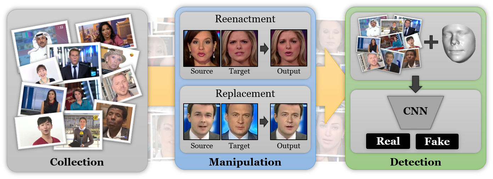

# 🎭 Multimodal Deepfake Detection System

## 📌 Overview
This project is a Multimodal Deepfake Detection System that detects whether an image, video, or audio is real or fake using AI models.

It also includes a special feature called **Bluriness Detection**, which helps identify image/video quality issues often found in deepfake content.

---

## 🚀 Features
- 🖼️ Image Deepfake Detection
- 🎥 Video Deepfake Detection (Frame + Face-based)
- 🎙️ Audio Deepfake Detection
- 📊 Fusion Model (Final Decision using multiple inputs)
- 📉 Bluriness Detection (Focus Analysis)
- 📱 QR Code Upload (Upload files from mobile to PC)
- 📋 Backend Logs & Analytics

---

## 🧠 Technologies Used

### Frontend
- React (Vite)
- HTML, CSS, JavaScript

### Backend
- FastAPI
- Python

### AI / ML
- Hugging Face Transformers
- OpenCV
- Librosa
- PyTorch

---

## 🤖 Models Used

### Image Model
- `dima806/deepfake_vs_real_image_detection`
- Detects fake vs real images using Vision Transformer

### Video Model
- `hamzenium/ViT-Deepfake-Classifier`
- Uses frame extraction + face cropping + ViT classification

### Audio Model
- `garystafford/wav2vec2-deepfake-voice-detector`
- Detects fake voices using Wav2Vec2

---

## ⚙️ How It Works

1. User uploads image/video/audio
2. Backend processes file
3. Model predicts REAL or FAKE
4. Bluriness is calculated (for image/video)
5. Results shown with confidence score
6. Fusion combines all results

---

## 📡 API Endpoints

- `POST /detect-deepfake-image`
- `POST /detect-deepfake-video`
- `POST /detect-deepfake-audio`
- `POST /qr-upload/sessions`

---

## 📱 QR Upload Feature

- Generate QR code
- Scan using mobile
- Upload file from phone
- File sent to backend server

---

## 🛠️ Setup Instructions

### Backend

cd backend
pip install -r requirement.txt
uvicorn main:app --host 0.0.0.0 --port 8000

### Frontend

cd frontend
npm install
npm run dev

---

## 📊 Output Example

{
"label": "FAKE",
"confidence": 0.92,
"blur_percent": 34.5
}

---

## 📌 Future Improvements
- Better face detection (MTCNN)
- Real-time detection
- Improved video temporal models
- Cloud deployment

---

## 👨‍💻 Author
Prashik Athawale